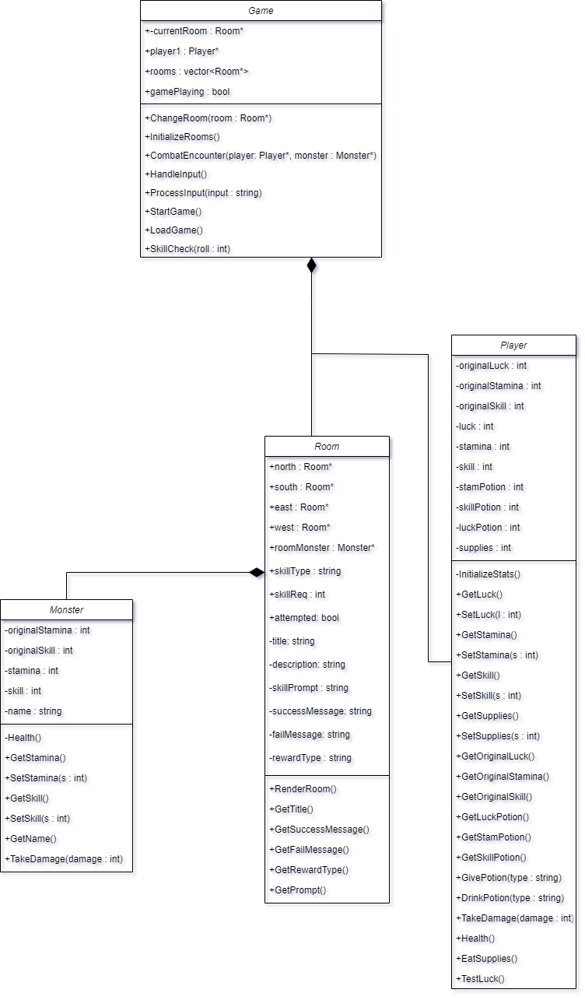

# Dungeon Game by Huw

# Development Information

This was made with Visual Studio 2022 on a Windows 11 machine.

## How to play

The game has a number of commands. Move/go (followed by north/south/east/west), drink, eat, save,inventory, interact (if there's something to interact with).

Moving is self-explanatory. The goal is to find the exit, and to do this you move between rooms.

Drinking is how you consume the potions that you can find along the adventure. Drinking a potion will restore your stats to their original levels.

Eating is how you consume your provisions. Eating a single provision restores 4 stamina.

Save is how you save your current game. When you open the program, you can either start a new game, or load a previous game. Saving will save your stats and current location.

Inventory gives you an overview of your character: all your stats will be printed, as will your entire inventory.

Interact is how you make skillchecks to complete the game. It is how you find potions and interact with objects in rooms.

## UML Diagram

## Error Handling

The program has been written with error handling to ensure it works properly in the case that the file it needs to access is unavailable.

## Test Case 1

- Test Scenario: Loading a file with the "saveFile.txt" in the correct location.
- Test Steps:
    - User opens program.
    - User enters "load" when prompted.
- Test Data: "saveFile.txt" in the same directory as the .exe
- Expected Result: data is read correctly from the file. Using the "Inventory" command in-game will show the Player's stats and inventory are the same as were saved to the .txt file.
- Actual result: as Expected.
- Test status: Pass.

## Test Case 2

- Test Scenario: Loading a file with no "saveFile.txt"
- Test Steps:
    - User opens program.
    - User enters "load" when prompted.
- Test Data: none.
- Expected Result: error message "Unable to open file". Game uses normal random generation for player stats and places them in the start room.
- Actual result: as Expected.
- Test status: Pass.

## Details

Main.cpp creates a "game" object. This contains a "gameplaying" bool that keeps the program in a while loop. The main game loop takes a player input, then checks it against a series of commands. If the player moves in a direction with a room, the ChangeRoom method is called, which updates the game's stored Room variable and then calls the function to render the room to the console.

## Video Link

https://www.youtube.com/watch?v=oOiVlh_EvuU

## Git Repo Link

https://github.com/stevenage-luton/DungeonGame